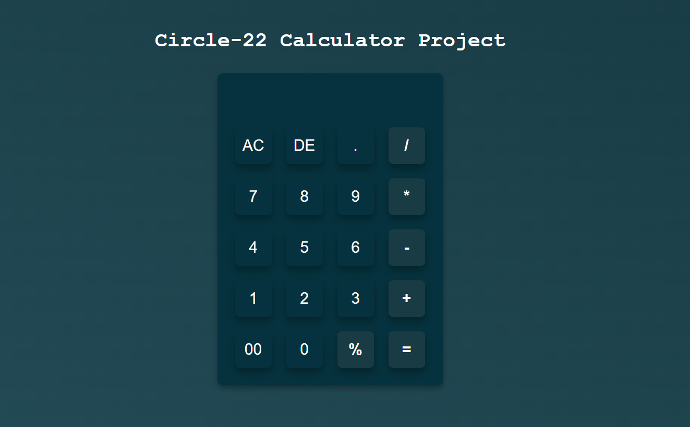

# CIRCLE-22 CALCULATOR ASSIGNMENT
This is a collaborative project for the AltSchool Africa Frontend Engineering Track Circle-22.

## Overview

### The challenge
To create a simple calculator app using only HTML, CSS, and JavaScript.

### Screenshot



## Calculator Functionalities

This calculator is used to perform basic arithmetic operations, including:

- Addition
- Subtraction
- Multiplication
- Division

## Calculator Buttons and Their Meanings

| Button | Meaning                   |
| ------ | ------------------------- |
| AC     | Clear input               |
| DE     | Delete               |
| +      | Addition                  |
| -      | Subtraction               |
| *      | Multiplication            |
| /      | Division                  |
| .      | Decimal point             |
| %      | Percent                   |
| =      | Result                    |


## How to Use the Calculator

Follow these simple steps to make any operation between numbers after you open the calculator app:

1. **Input the First Number**: Start by entering the first number you want to use in your calculation. 

2. **Select the Desired Operation**: Press the button for the desired operation you want to perform
   - Addition (+)
   - Subtraction (-)
   - Multiplication (*)
   - Division (/)

3. **Input the Second Number**: After selecting the operation, input the second number by tapping the appropriate digits on the calculator's display.

4. **Calculate the Result**: To calculate the result, simply press the "=" (equals) button. 

5. **View the Result**: The result of the calculation will be displayed on your screen. 

That's it! You can repeat these steps for any other calculations you need to make.


## Built with

-  HTML

```html
    <div class="wrapper">
      <h1>Circle-22 Calculator Project</h1>
      <form>
        <div class="input-box">
          <input type="text" name="display" class="display" />
        </div>
        <div class="box">
          <input type="button" value="AC" />
          <input type="button" value="DE" />
          <input type="button" value="." />
          <input type="button" value="/" />
        </div>
      </form>
    </div>
```

- CSS properties

```css
* {
  padding: 0;
  margin: 0;
  box-sizing: border-box;
  font-family: sans-serif;
}

body {
  width: 100%;
  height: 100vh;
  background: linear-gradient(to top right, #e3f9ff, #b5e9f8);
}

.wrapper {
  width: 100%;
  height: 100%;
  display: flex;
  flex-direction: column;
  align-items: center;
  justify-content: center;
}
```

- JavaScript Functions

```javascript
const fourthBox = document.querySelectorAll(".box-4");
const display = document.querySelector(".display");
const equalBtn = document.querySelector("#equal");

fourthBox.forEach((box) => {
  box.addEventListener("click", () => {
    display.value += box.value;
  });
});

equalBtn.addEventListener("click", () => {
  display.value = eval(display.value);
});
```

## Setting up the repository

Follow these steps to set up the repository on your local machine:

- Install the dependencies by running
```
npm install
```
- Start the development server by running
```
npm run dev
```
- Open `http://localhost:3000/` in your browser to view the app


## Links

- [GitHub](https://github.com/Doziechuks/Cirlcle-22-Calculator-Assignment)
- [Live link](https://circle-22-calculator-project.netlify.app/)

## Contributors

- [Obodozie Chuka Cornelius](https://github.com/Doziechuks)
- [Adetutu Oluwasanmi](https://github.com/adetutudeborah)
- [Kehinde Ogundele](https://github.com/Ogun6ele)
- [Lucas Lulyeho](https://github.com/lucaslulyeho)
- [Onigbinde Peter](https://github.com/petroritse1)
- [Ogbunude Chidinma Amanda](https://github.com/amyol123)


